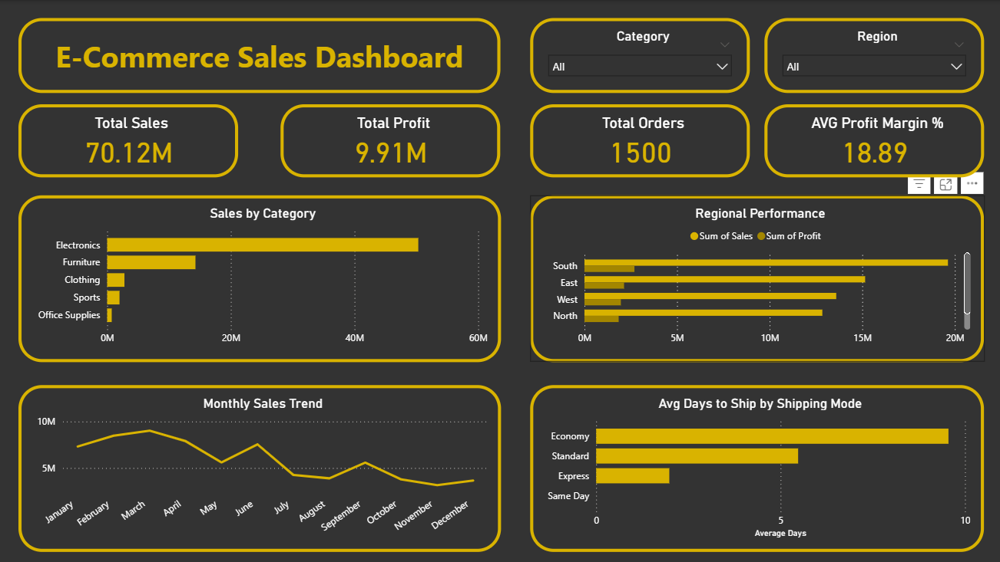

# E-Commerce Sales Analysis Dashboard

## Project Overview
End-to-end data analysis project on 1,500 e-commerce orders across
5 product categories and 5 regions in India.

## Tools Used
- **Excel** — Data cleaning (duplicates, negative discounts,
  missing sales values, text standardisation)
- **SQL** — 10 queries for sales, profit, regional performance,
  customer rankings, discount impact, and shipping analysis
- **Power BI** — Interactive dashboard with KPIs, trend charts,
  regional comparison, and slicers

## Key Insights
- Electronics contributed 72% of total revenue (~₹70 crore)
- South India was the top-performing region
- Economy shipping averaged 9.6 days vs Same Day at 0 days
- Overall profit margin: 18.9% across 1,500 orders

## Dashboard Preview

## Files
- `Ecommerce_Sales_Analysis.xlsx` — Raw data, cleaned data,
  summary sheet
- `ecom_analysis_queries.sql` — 10 SQL queries with comments
- `ecommerce_dashboard.png` — Power BI dashboard screenshot

## Author
Kishore Kumar K | Aspiring Data Analyst | Chennai
GitHub: https://github.com/kizhore15
